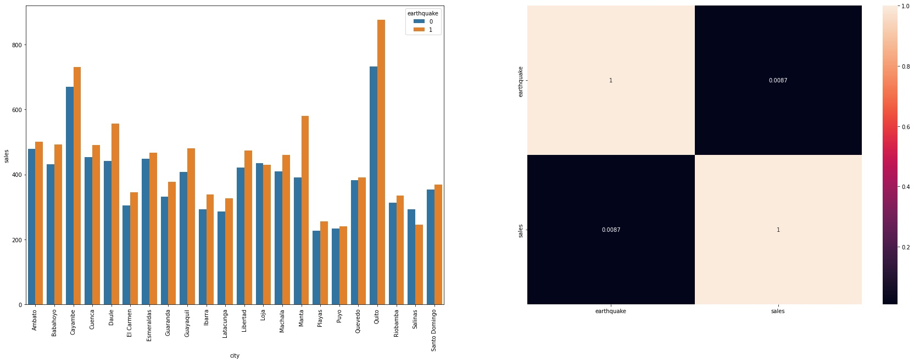
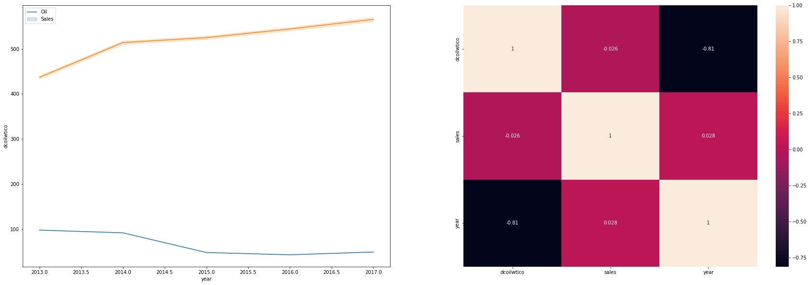
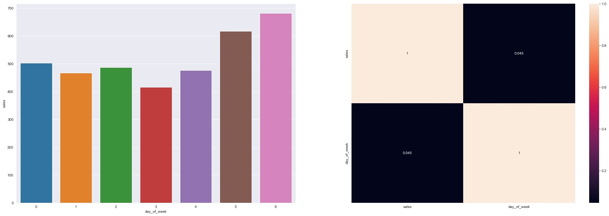
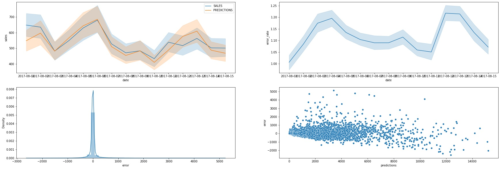

# [Favorita Sales Prediction](https://t.me/favoritasales_bot)

#### This project was made by Rodrigo Vieira.

# 1. Business Problem.
- O CEO da rede varejista Favorita precisa que a gestão de estoque das unidades seja mais eficaz, a fim de que não haja produto parado em estoque por muito tempo, nem falte produtos nas gondolas. Para isso, precisa da projeção do volume de vendas de cada uma das lojas para as próximas 2 semanas, separado por tipo de alimento.

# 2. Business Assumptions.
- Os registros de vendas partem da mesma data para todas as lojas.
- Dias sem vendas ou de loja fechada serão desconsiderados.
- Equador é um país que não produz seu próprio petróleo, sendo assim a saúde economica do país pode variar de acordo com a cotação deste comodity.
- Feriados e dias de pagamento do salário do setor público podem afetar o volume de vendas
- Eventos e catástrofes serão considerados mediante análise prévia.

# 3. Solution Strategy

My strategy to solve this challenge was:

**Step 01. Data Description:**
Conhecer a dimensão dos dados fornecidos, bem como preencher nulos e realizar análise descritiva de dados numéricos e categóricos.

**Step 02. Feature Engineering:**
Criar novos atributos que agreguem à descrição do fenômeno.

**Step 03. Data Filtering:**
Remover registros e atributos que não agregam para a descrição do fenômeno, reduzindo o dimensionamento da base de dados e facilitando o aprendizado do modelo.

**Step 04. Exploratory Data Analysis:**
Entender o comportamento dos atributos que compoem a base de dados, analisando-os tanto isoladamente quanto em conjunto com outras variáveis. Consequentemente gerando insights e entendendo a relevância de cada atributo na composição do fenômeno.
Utilizei do conceito dos quartis para identificar os atributos com comportamento mais relevante e definir outliers a fim de mitigar o efeito dos eventos descritos no problema de negócio (copa do mundo em julho de 2014 e terremoto no Equador em abril de 2016)

**Step 05. Data Preparation:**
Utilizar ferramentas estatísticas e matemáticas para ajustar a escala de variáveis numéricas, transformar a natureza de variáveis cíclicas e traduzir variáveis categóricas em numéricas, com o intuito de adequar os dados para uso dos modelos de Machine Learning

**Step 06. Feature Selection:**
Com auxílio do algoritmo Boruta, selecionar o menor número de atributos possível para maximizar o aprendizado do modelo de Machine Learning

**Step 07. Machine Learning Modelling:**
Testar o poder preditivo de alguns modelos de Machine Learning (Linear Regression, Linear Regression Regularized, Random Forest e XGBoost), tendo como baseline o modelo de média aritmética.

**Step 08. Hyperparameter Fine Tunning:**
Utilizar a técnica de Random Search para encontrar o conjunto de hiperparâmetros que maximiza o aprendizado do modelo de Machine Learning escolhido na etapa anterior.

**Step 09. Convert Model Performance to Business Values:**
Traduzir as métricas de performance do modelo para o time de negócio, utilizando MAPE e MAE para projetar o retorno financeiro.

**Step 10. Deploy Modelo to Production:**
Construir uma API para disponibilizar o acesso à previsão de vendas a partir do smartphone, utilizando um bot no aplicativo de mensagens Telegram.

# 4. Top 3 Data Insights

**Hypothesis 01:** A ocorrência de fenomenos climáticos aumenta o número de vendas

**True.** A ocorrência de fenomenos climáticos aumenta ligeiramente as vendas na maioria das cidades

**Hypothesis 02:** O preço do petróleo é inversamente proporcional ao número de vendas ao longo dos anos

**True.** O volume de vendas aumenta ao passo que o preço do petróleo diminui

**Hypothesis 03:** Na semana, o maior volume de vendas se concentra de sexta à domingo

**False.** O maior volume de vendas se concentra de sábado à segunda

# 5. Machine Learning Model Applied
| Model Name | MAE | MAPE | RMSE |
| --- | --- | --- | --- |
| Baseline (Average Model) | 99.423 | 0.0357 | 316.842 |
| XGBoost | 116.29 | 0.43 | 409.47 |
| Random Forest | 74.21 | 0.35 | 272.04 |
| XGBoost (tunned) | 75.91 | 0.35 | 267.91 |

# 6. Machine Learning Model Performance

# 7. Business Results
| Possível cenário | Vendas nas próximas 2 semanas |
|   ---   |     ---      |
| Previsão | 12.201.257,08 |
| Pior cenário | 12.087.996,99 |
| Melhor cenário | 12.314.517,17 |

# 8. Conclusions
- A XGBoost se mostrou a melhor escolha para este projeto de previsão. Apesar de apresentar uma acurácia ligeiramente menor do que a Random Forest na fase de testes, a XGBoost performa melhor com menos recursos, garantindo que a solução não se torne muito cara para implementar e manter.

# 9. Lessons Learned
Pensando em Ciência de Dados, muito se discute sobre a escolha do algoritmo de Machine Learning mais adequado à necessidade do cliente. No entando, neste primeiro projeto treinando e aplicando um modelo, percebo que o cerne do processo está na capacidade analítica de quem o conduz. A etapa de Análise Exploratória de Dados (EDA) é crucial, e não por acaso a que mais demanda tempo do cientista de dados. Nela podemos aprofundar nosso conhecimento sobre o negócio, gerar insights valiosos, identificar fraquezas e potenciais que por si só podem causar tanto impacto quanto o produto final.

# 10. Next Steps to Improve
- Criar um dashboard com mais detalhes sobre os valores previstos

# All Rights Reserved - Comunidade DS 2022
